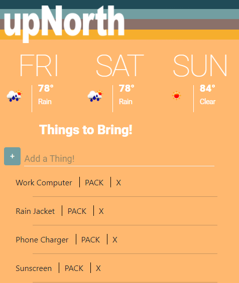

  # upNorth
  

  ### Description
  This app is to create a reusable packing app for traveling to Horton Bay, MI. When a user logs in, they will be provided with the coming weekend's weather and a packing list.

  ### Screenshot
  

  ### Live
  [Deployed on Heroku](https://https://upnorth.herokuapp.com/)

### Future Development
As this app evolves, the packlist provided will be specific to the user that is logged in. The packlist will also be related to the projected weekend weather and what the user likes to bring on those warm summer or cold winter weekends.

  ### Usage
  For now this is a wide open app. Once the authenticator is addedd, a login will be required to use this app. Please contact me for use!

  ### Questions
  github: ampieschke  
  email: ampieschke@gmail.com
  